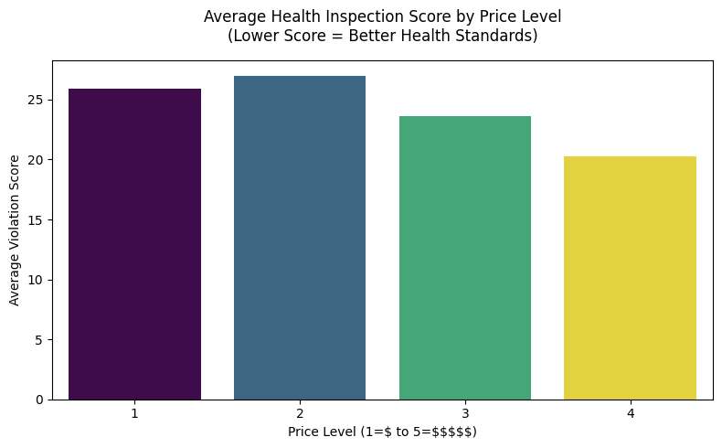
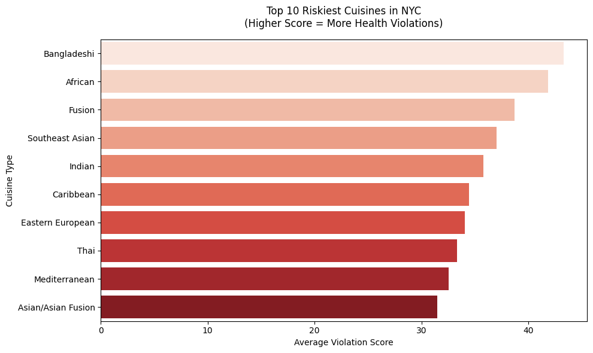
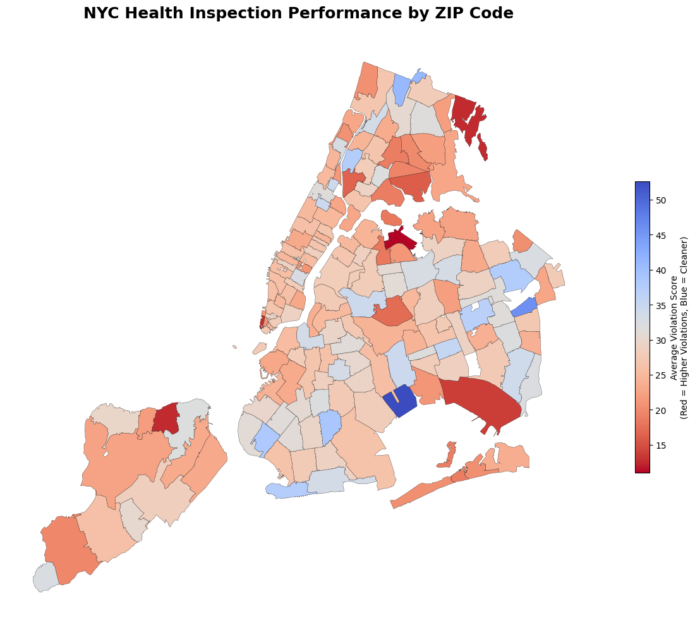
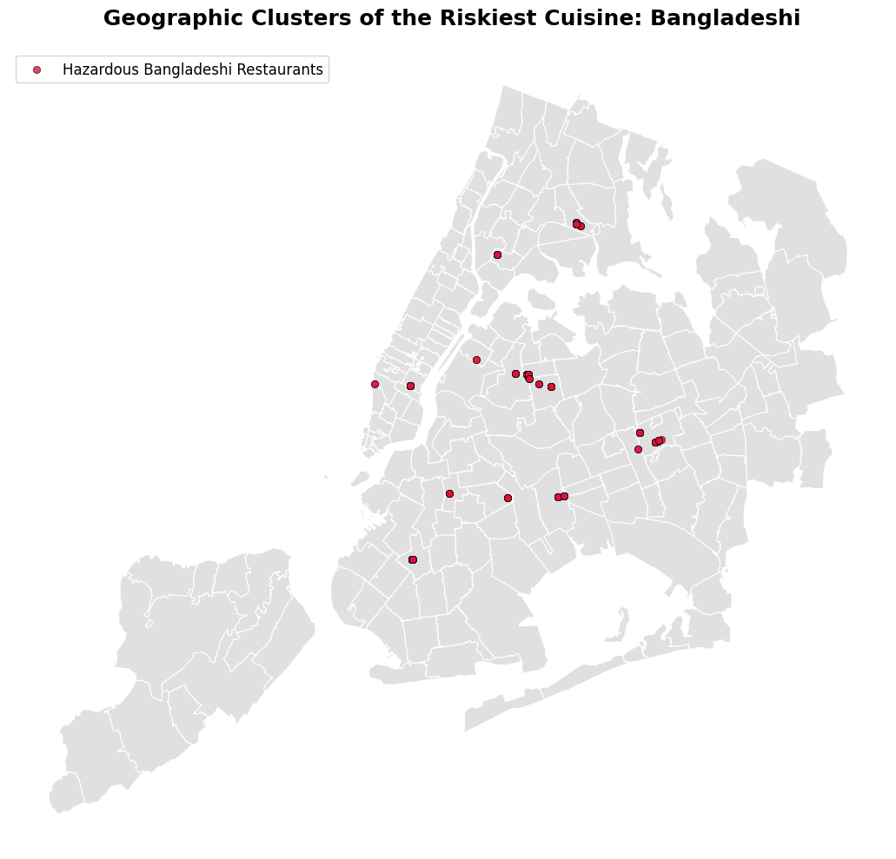

<div align="center">
  <h1>🗽 NYC Restaurant Intelligence</h1>
  <p><i>An End-to-End Data Pipeline & Geospatial Analysis of NYC Health Inspections</i></p>
  
  [](https://www.python.org)
  [](https://pandas.pydata.org/)
  [](https://geopandas.org/)
  [](https://sqlite.org/)
</div>


## Overview
The **NYC Restaurant Intelligence** project is a robust data engineering and analytics pipeline that extracts, processes, and analyzes restaurant inspection data from NYC Open Data. It bridges raw data with business strategy by identifying health violation hotspots, risky cuisine types, and the correlation between restaurant price levels and health standards through advanced spatial intelligence.

## Key Features
- **Automated ETL Pipeline**: Dynamically extracts thousands of records from the NYC Open Data API using efficient, paginated requests.
- **Robust Storage**: Transforms raw JSON data into structured Pandas DataFrames and loads it into a local SQLite database for fast, complex querying.
- **Geospatial Intelligence**: Leverages GeoPandas to map spatial point data against NYC zip code shapefiles, identifying geographical clusters of high-risk restaurants.
- **Statistical EDA**: Uncovers insights such as the Top 10 Riskiest Cuisines and the relationship between price levels and health inspection scores.

## Technology Stack
- **Languages**: Python, SQL
- **Data Engineering**: Pandas, Requests, SQLAlchemy, SQLite
- **Geospatial & Visualization**: GeoPandas, Matplotlib, Seaborn, Folium
- **Environment**: Jupyter Notebook, `python-dotenv`

## Getting Started

### 1. Clone the Repository
```bash
git clone https://github.com/bdiaa248/NYC_Restaurant_Intelligence.git
cd NYC_Restaurant_Intelligence
```

### 2. Set Up the Environment
Create a virtual environment and install the required dependencies:
```bash
pip install -r requirements.txt
```

### 3. Configure API Credentials
Create a `.env` file in the root directory and add your API keys (optional but recommended for higher rate limits):
```env
NYC_OPEN_DATA_APP_TOKEN=your_app_token_here
RESTAURANTS_API_KEY=your_business_api_key_here
```

### 4. Run the Pipeline
Open the Jupyter Notebook to execute the ETL and EDA processes:
```bash
jupyter notebook notebooks/01_etl_and_eda.ipynb
```

*Note: Ensure you download the NY Zipcode shapefiles into the `data/spatial/` directory before running the geospatial analysis cells.*

## Insights & Visualizations

### 1. Price vs. Cleanliness
Visualizing how average health scores vary across different price points ($ to $$$$$). *Note: Lower score indicates fewer violations (cleaner).*

<div align="center">

</div>

### 2. Cuisine Risk Factors
Identifying the cuisine types with the highest average violation scores in NYC.

<div align="center">

</div>

### 3. Hotspot Mapping & Spatial Clustering
Layering the most hazardous restaurants over the NYC basemap to pinpoint geographic clusters.

<div align="center">

</div>
<br>
<div align="center">

</div>

---
<div align="center">
  <b>Developed by Abdelrahman Diaa</b><br>
  <i>Data Analyst | Spatial Data Engineer</i><br><br>
  <a href="https://www.linkedin.com/in/diaa-shousha/">
    
  </a>
  <a href="https://github.com/bdiaa248">
    
  </a>
</div>
